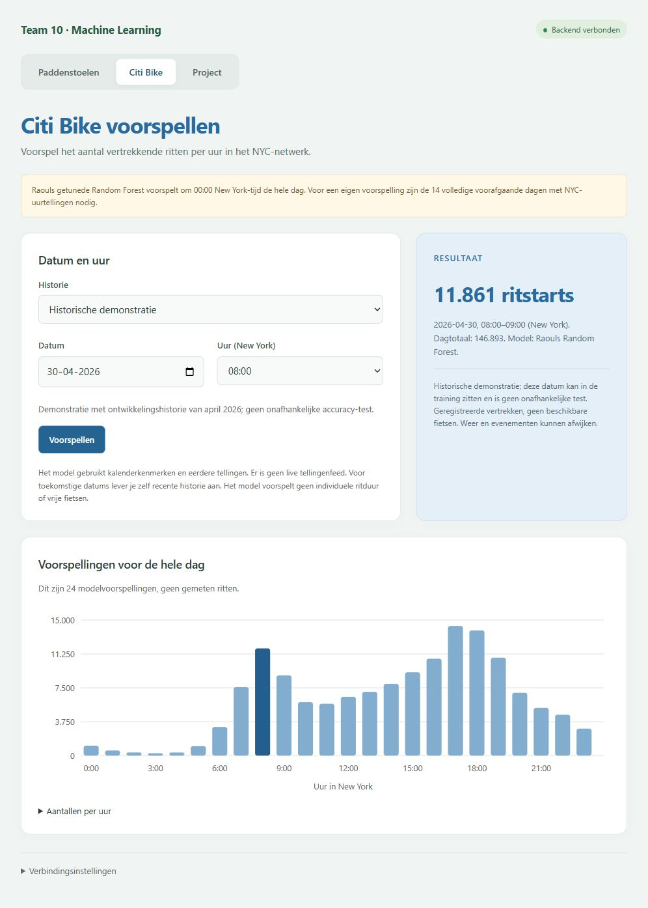

# Frontend met Raouls gekozen Citi Bike-model

De website en `POST /predict/citibike` gebruiken **Raouls getunede Random Forest
met 320 bomen**. Dit is de vóór de eindtest gekozen versie uit
`SolutionRaoul/Citybike`. De oorspronkelijke joblib-SHA-256 is
`aea5c81d306facc1fadd8dd1888a08219d3afabda16a11b63db7271a694f509f`.
De latere verkennende LightGBM-kandidaat vervangt dit model niet.

## Invoer en voorspeltijdstip

Het model voorspelt om **00:00 America/New_York** de 24 lokale klokvakken van
die kalenderdag. Het uur in het formulier kiest één waarde uit dezelfde
dagvoorspelling. Alle tellingen moeten strikt daarvoor beschikbaar zijn.

- **Historische demonstratie:** 15–30 april 2026, met de 14 voorafgaande dagen
  aan ontwikkelingshistorie. Deze datums kunnen in de training zitten en vormen
  geen onafhankelijke accuracy-test.
- **Eigen recente historie:** upload een klein CSV-bestand met `timestamp`,
  `rides`, `area`. Alleen NYC is toegestaan. De frontend selecteert de 336
  voorafgaande lokale uurvakken; de server valideert opnieuw volledigheid,
  unieke uurvakken, eindige niet-negatieve tellingen, gebied en tijdgrens.

Er is geen live tellingenfeed. Toekomstige voorspellingen vereisen tijdig
beschikbare eigen tellingen. Voor morgen moeten de tellingen van vandaag dus
eerst volledig bekend zijn. Een eerder voorspelmoment vereist een nieuwe studie.
Een ontbrekend voorjaaruur is nul; het herhaalde najaarsuur bevat beide fysieke
uren. Er blijven altijd 24 kloklabels.

```json
{"date":"2026-04-30","hour":8,"mode":"demo"}
```

Voor eigen historie: `mode="history"`, dezelfde `date`/`hour` en een `history`
array met precies 336 objecten, bijvoorbeeld
`{"timestamp":"2026-04-16T00:00:00","rides":1234,"area":"NYC"}`.
Timestamps hebben geen tijdzone-offset en vallen op volledige lokale uren.
Onjuiste invoer geeft 422; een niet geladen model geeft 503.

## Zelfde model, compacter hostingformaat

De volledige joblib is 647,3 MiB en past niet als gewone geladen pipeline op de
[gratis Render-service met 512 MB](https://render.com/docs/blueprint-spec).
`backend/export_raoul_citibike.py` exporteert alle **9.425.974 knopen** uit
dezelfde 320 bomen naar 25-byte NumPy-records: beide kindindices, feature-index,
float64-drempel en float64-bladwaarde. RF-invoer blijft float32, zoals sklearn.
Alle bomen worden in oorspronkelijke volgorde gemiddeld. Het gedeelde
`SolutionRaoul.Citybike.citibike.inference.predict_day` berekent dezelfde
features, clipping en zomertijdregels. Geen pruning, quantisatie, selectie of
hertraining. Het oorspronkelijke model en de eindtest blijven ongewijzigd.

De arrays beslaan circa 225 MiB op schijf en worden memory-mapped; het
ZIP-pakket is circa 86 MiB. De export is op alle 1.464 bestaande validatievakken
vergeleken met het originele artefact: maximaal 3,64×10⁻¹² verschil in voorspelling.
Deze check bewijst numerieke reproductie en is geen nieuwe prestatie-evaluatie.
De API-tests vergelijken bovendien echte dagvoorspellingen, voorjaar/najaar,
en gedeelde features met opgeslagen referentievoorspellingen.

Het artefact staat als [GitHub Release-asset](https://github.com/JorreVanDyck10/DeepLearningTeam10/releases/tag/raoul-citibike-rf-20261009),
dus **buiten Git**. `backend/citibike_artifact.json` pint URL, pakketchecksum,
de oorspronkelijke modelchecksum, alle interne bestandschecksums en gedeelde
featurecode. Downloaden gebeurt uitsluitend bij ontbrekende lokale bestanden;
laden of inference traint nooit een model. Oude baseline-instellingen worden
genegeerd; een fout geeft een expliciete ontbrekende-modelstatus.

## Uitvoeren en exporteren

Voor de teamwebsite maak je een aparte Python 3.13-omgeving; de oorspronkelijke
Python 3.11/PyCaret-omgeving blijft intact:

```powershell
py -3.13 -m venv .venv-serving
.\.venv-serving\Scripts\python.exe -m pip install -r backend/requirements-dev.txt
.\.venv-serving\Scripts\python.exe -m unittest discover -s tests -v
node --test tests/test_api_client.cjs tests/test_citibike_frontend.cjs
.\.venv-serving\Scripts\python.exe -m uvicorn backend.main:app --host 127.0.0.1 --port 8000
```

De server haalt de gepinde release zelf op. Open `http://127.0.0.1:8000/#citibike`.
`/health` moet `citibike_model_id="raoul_tuned_random_forest_320"` rapporteren.
De frontend controleert diezelfde ID en kan een baselineantwoord niet als
Raouls model presenteren.

Op Raouls computer is het getrainde originele model lokaal aanwezig. Met de
oorspronkelijke vastgelegde omgeving kun je de export reproduceren:

```powershell
.\SolutionRaoul\Citybike\.venv\Scripts\python.exe -m backend.export_raoul_citibike
.\.venv-serving\Scripts\python.exe -m backend.publish_raoul_artifact
```

De exporter verwacht een nieuwe, lege `models/serving`-map en overschrijft geen
bestaande export. Het publicatiescript gebruikt de bestaande Git Credential
Manager-authenticatie voor deze repository en schrijft geen credentials naar
schijf of console. Een afwijkende bestaande gepinde release wordt geweigerd.

Render blijft dezelfde frontend en API op hetzelfde domein serveren en volgt
`main`. De bestaande build/startcommando's werken ongewijzigd. De eerste start
van een nieuwe instantie downloadt circa 86 MiB; volgende starts met een geldige
lokale cache hoeven niet te downloaden. Render free kan na inactiviteit slapen.

## Getoonde prestaties

De projectpagina toont de bestaande onafhankelijke eindtest van juli–augustus
2026: RMSE 1.979,51, MAE 1.076,23, R² 0,8280 en 24,12% lagere RMSE dan de
weekbaseline. Dit veronderstelt dezelfde tijdig beschikbare historie en voorspelt
geregistreerde vertrekken, geen beschikbare fietsen of onvervulde vraag. De
getoonde demonstratie-uitkomst is geen nieuwe eindtest. Weer/evenementen en
latere maanden kunnen afwijken. Codex implementeerde en controleerde deze
frontend/API-koppeling en lossless export; de menselijke bijdrageverdeling blijft
door het team aan te vullen.

## Live controle op 9 oktober 2026

De [openbare website](https://deeplearningteam10-api.onrender.com/#citibike) meldt
`raoul_tuned_random_forest_320`. Demo en eigen-historieroute geven dezelfde 24
voorspellingen als het oorspronkelijke model, tot maximaal 1,82×10⁻¹² numeriek
verschil. Twee gemeten warme API-aanvragen duurden circa 3,1 en 3,3 seconden.
17 Python- en 13 JavaScript-tests slagen; ook de
[GitHub-controles op Linux/Python 3.13](https://github.com/JorreVanDyck10/DeepLearningTeam10/actions/runs/37935263402)
zijn geslaagd. Exacte metingen staan in
`SolutionRaoul/Citybike/reports/frontend_deployment_verification.json`.


