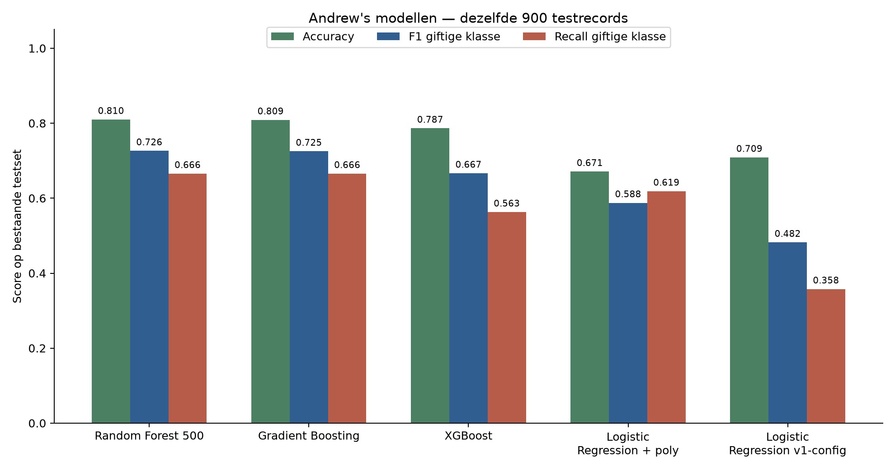
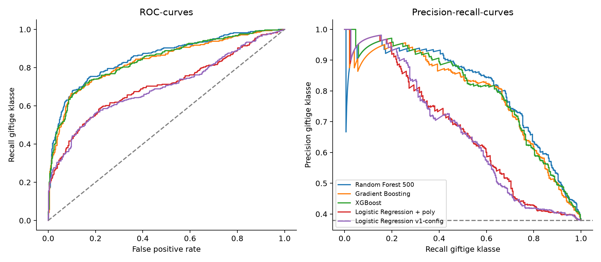
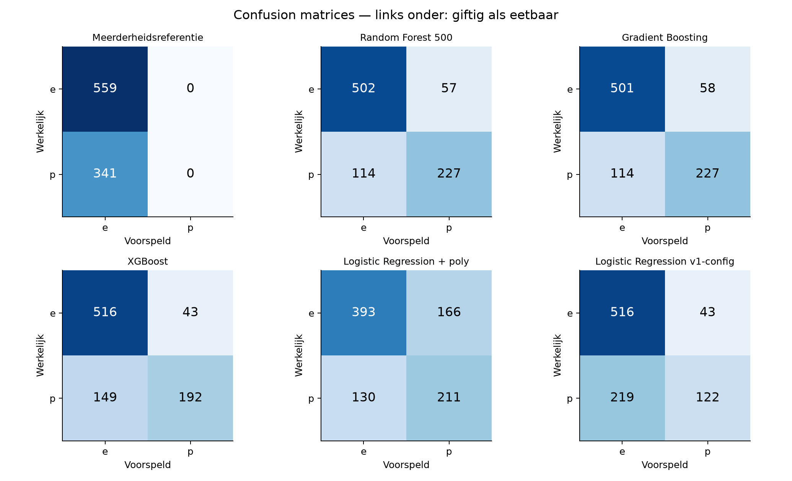
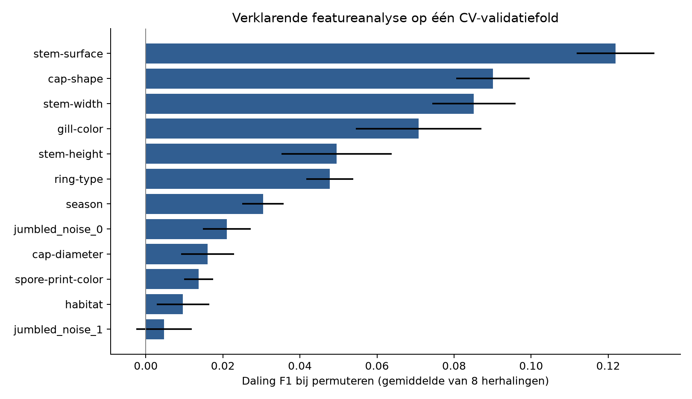

# Vergelijkingsrapport: Andrew's Mushroom-modellen

**DeepLearningTeam10 — 9 oktober 2026.** Analyse van de modeldefinities en bestanden uit
broncommit [`17c4a61`](https://github.com/JorreVanDyck10/DeepLearningTeam10/commit/17c4a61).
Bijbehorend uitgevoerd notebook: [09_compare_models.ipynb](09_compare_models.ipynb).

## Besluit en afbakening

**Random Forest 500 is de voorlopige keuze binnen Andrew's datasetversie.** Het behaalt de
hoogste gemiddelde F1 voor de giftige klasse in vijfvoudige kruisvalidatie: **0,6804**.
Op de bestaande testset zijn Random Forest en Gradient Boosting vrijwel gelijk: **81,00%
tegenover 80,89% accuracy**, een verschil van één correcte voorspelling op 900 records.
Beide herkennen 227 van de 341 giftige records en classificeren **114 giftige records als
eetbaar**. Dat is 33,43% van de giftige testrecords.

Dit is een vergelijking van Andrew's bestand met **5.000 records en 12 features**.
Het is geen definitieve rangschikking van alle Mushroom-modellen van het team. De volledige
UCI-data, de AWS-resultaten en de eerder gedeployde Random Forest gebruiken andere data
of een andere testsplit. De onderzochte gegevens zijn bovendien gesimuleerd; deze demo
kan geen eetbaarheid van echte paddenstoelen bepalen.

## 1. Aansluiting op de opdracht en bijdragen

De opdracht vraagt per dataset een notebook dat modelmetrics verzamelt, modellen grondig
vergelijkt en conclusies bevat. De rubric beoordeelt ook passende validatie, concrete
foutanalyse en reproduceerbaarheid. Dit rapport en notebook leveren voor Andrew's modellen
die vergelijking, inclusief een referentiemodel, opgeslagen modelcontrole, confusion
matrices, train/validatie/test-scores en een onderbouwde voorlopige keuze.

| Bijdrage | Wie / status |
| --- | --- |
| Oorspronkelijke datasetversie, notebook en modeldefinities | Andrew Noeyens; gecommitteerde bronbestanden |
| Aanvraag voor dit vergelijkingsrapport | Jorre Van Dyck |
| Reproductiescript, nieuwe CV-evaluatie, grafieken, notebook en rapporttekst | Codex, uitgevoerd in de lokale projectomgeving |
| Inhoudelijke teamreview en mondelinge verdediging | Nog door het team uit te voeren; dit rapport beweert geen afgeronde review |

AI-gebruik is hiermee expliciet vermeld. Teamleden moeten de keuzes en beperkingen zelf
kunnen uitleggen. Dit rapport vervangt de volledige EDA, AutoML, systematische tuning,
afzonderlijke modelnotebooks of Citi Bike-vergelijking niet.

## 2. Welke modellen zijn werkelijk aanwezig?

Bronmap: [SolutionAndrew/MushroomDataset](../SolutionAndrew/MushroomDataset/).
Andrew's huidige `mushroom.ipynb` bevat vier classifiers. Twee `.pkl`-bestanden bevatten
opgeslagen pipelines. Die bestanden zijn met **joblib** opgeslagen.

| Kandidaat | Instellingen die opnieuw zijn uitgevoerd | Reden voor vergelijking |
| --- | --- | --- |
| Meerderheidsreferentie | Altijd `e` voorspellen | Laat zien waarom accuracy alleen onvoldoende is |
| Random Forest 500 | 500 bomen; depth 20; min split 3; min leaf 1; max features sqrt; balanced class weights | Boomensemble kan categorische combinaties en niet-lineaire patronen modelleren |
| Gradient Boosting | 350 bomen; learning rate 0,08; depth 8; min split 4; min leaf 2; subsample 1 | Sequentiële bomen corrigeren eerdere fouten; relatief diepe bomen kunnen overfitten |
| XGBoost | 500 bomen; learning rate 0,05; depth 5; min child weight 2; subsample en colsample 0,8 | Andere boostingimplementatie met sampling en regularisatiemogelijkheden |
| Logistic Regression + poly | Numerieke polynomial features graad 2; scaling; C=1; balanced; max iter 3.000 | Vergelijking met een eenvoudiger beslisfunctie en beperkte numerieke interacties |
| Logistic Regression v1-config | Geen polynomial features; numerieke missing indicators en scaling; C=1; geen class weights; max iter 2.000 | Controle van de werkelijk opgeslagen LR-configuratie |

**De opgeslagen Logistic Regression is een ander model dan de huidige notebookvariant.**
We vergelijken daarom beide configuraties apart. De v1-configuratie wordt vanuit de
opgeslagen pipeline gekloond en opnieuw getraind; `clone` neemt geen aangeleerde parameters
mee. Hierdoor gebruikt ook deze kandidaat precies dezelfde nieuwe CV-folds en trainingsset.

De opgeslagen Gradient Boosting reproduceert de notebookconfiguratie. Voor beide opgeslagen
pipelines komen de labels én de waarschijnlijkheidsscores op deze 900 records exact overeen
met hun opnieuw getrainde tegenhanger. Hun oorspronkelijke trainingslidmaatschap is niet
apart bewezen; de hoofdvergelijking berust daarom op de gecontroleerde hertraining.

Het oudere bestand `models/random_forest.joblib` bevat **200 bomen**, gebruikt een eerdere
80/20-split en hoort bij de huidige API-configuratie. Het is niet het RF500-model uit de
nieuwste notebook. Voor RF500 en XGBoost staan in deze broncommit modeldefinities en outputs,
maar geen nieuwe afzonderlijk geëxporteerde modelbestanden. In de onderzochte notebook staat
geen vastgelegd GridSearch/RandomizedSearch-traject; gekozen hyperparameters zijn niet op
zichzelf bewijs van systematische tuning.

## 3. Data, schoonmaak en vergelijkbaarheid

Het gecommitteerde CSV-bestand heeft 5.000 rijen: 3.107 `e` en 1.893 `p` (37,86%).
De features zijn drie numerieke metingen en negen categorische velden, waaronder
`jumbled_noise_0` en `jumbled_noise_1`. De herkomst en bewerkingen van deze 5.000-rijenversie
zijn niet voldoende vastgelegd om haar als willekeurige UCI-steekproef te behandelen.

Het oorspronkelijke [UCI Secondary Mushroom-dataset](https://archive.ics.uci.edu/dataset/848/secondary+mushroom+dataset)
beschrijft 61.069 gesimuleerde paddenstoelen op basis van 173 soorten met 20 features.
De aanvullende noise-kolommen en ontbrekende oorspronkelijke features maken Andrew's
probleemdefinitie verschillend van de volledige UCI-versie.

Zoals in Andrew's notebook worden nullen in `stem-height` en `stem-width` omgezet naar
ontbrekende waarden (60 records hebben minstens één zulke nul). Dit is een overgenomen
schoonmaakkeuze die nog een inhoudelijke motivatie in de uiteindelijke EDA nodig heeft.
Numerieke waarden worden met de trainingsmediaan ingevuld; categorische waarden met de
trainingsmodus en daarna one-hot encoded. Onbekende categorieën worden genegeerd.
De LR-varianten voegen hun hierboven beschreven transformaties toe.

| Feature | Ontbrekend na schoonmaak |
| --- | --- |
| cap-diameter | 40.64% |
| stem-height | 21.24% |
| stem-width | 9.04% |
| spore-print-color | 94.80% |
| gill-color | 19.78% |
| habitat | 20.08% |
| season | 19.46% |
| ring-type | 11.54% |
| cap-shape | 8.12% |
| stem-surface | 67.18% |
| jumbled_noise_0 | 8.12% |
| jumbled_noise_1 | 8.12% |

Er zijn geen exact gelijke volledige rijen gevonden en geen exact overeenkomende feature-rijen
tussen train en test. Dat sluit afhankelijkheid tussen nabije, verwante of gesimuleerde
records niet uit. De hoge ontbrekendheid van `spore-print-color` en `stem-surface` beperkt
hoeveel informatie deze velden voor afzonderlijke voorspellingen leveren.

## 4. Evaluatieprotocol en metrics

1. Reproduceer Andrew's gestratificeerde split: `test_size=0.18`, `random_state=42`.
   Dit geeft 4.100 trainingsrecords en 900 testrecords, waarvan 559 `e` en 341 `p`.
2. Gebruik op de 4.100 trainingsrecords vijf identieke gestratificeerde validatiefolds,
   met shuffle en seed 42. Per fold worden de volledige preprocessing en classifier
   uitsluitend op de fold-trainingsrecords gefit.
3. Selecteer de kandidaat met de hoogste gemiddelde **F1 voor p**; gemiddelde recall p
   is de tie-breaker. Deze keuze wordt in het script vastgelegd vóór de testmetrics worden berekend.
4. Fit vervolgens elke configuratie op alle 4.100 trainingsrecords en analyseer de bestaande
   900 testrecords. Gebruik de standaard `predict`-beslissing (grens rond 0,5); pas geen
   drempel of hyperparameter aan op basis van de testuitkomsten.

De positieve klasse is `p` (intern 1); `e` is 0. Accuracy telt alle correcte labels.
Recall p = TP/(TP+FN) meet hoeveel giftige records worden herkend. Precision p = TP/(TP+FP)
meet hoe vaak een giftig-voorspelling klopt. F1 combineert die twee. Balanced accuracy
weegt beide klasserecalls gelijk. ROC-AUC en average precision (AP) beoordelen de rangschikking
van modelscores over meerdere drempels; AP is geen gemeten recall bij de huidige drempel.

F1 is hier een expliciete ontwikkelkeuze om beide fouttypen mee te wegen, geen onderbouwde
veiligheidsgrens. Recall en het aantal FN blijven daarom zichtbaar. Voor een toekomstig
gebruik met asymmetrische foutkosten moet het team eerst een doel voor recall of foutkosten
vastleggen en een drempel uitsluitend op trainingsvalidatie bepalen.

**Deze testset was al in Andrew's notebook bekeken.** De modelkeuze gebruikt in deze nieuwe
run alleen CV, maar de eerdere experimenten kunnen al door testresultaten zijn beïnvloed.
Dit is een ontwikkelvergelijking, geen nieuwe onaangeroerde eindtest. De foldspreiding is
geen betrouwbaarheidsinterval voor de rangschikking. Een definitieve vergelijking vraagt
een vooraf vastgelegde gemeenschappelijke dataversie en een werkelijk nieuwe eindtest of
een passend protocol voor de beschikbare gegevens. Zie het
[scikit-learn-validatieprotocol](https://scikit-learn.org/stable/modules/cross_validation.html).

## 5. Resultaten en reproductie van Andrew's output

### Selectie op trainingsvalidatie

| Model | CV F1 p ± SD | CV recall p | CV accuracy |
| --- | --- | --- | --- |
| Random Forest 500 | 0.6804 ± 0.0246 | 0.6173 | 0.7805 |
| XGBoost | 0.6567 ± 0.0234 | 0.5683 | 0.7751 |
| Gradient Boosting | 0.6542 ± 0.0244 | 0.5863 | 0.7651 |
| Logistic Regression + poly | 0.5553 ± 0.0134 | 0.5799 | 0.6485 |
| Logistic Regression v1-config | 0.4561 ± 0.0336 | 0.3409 | 0.6934 |
| Meerderheidsreferentie | 0.0000 ± 0.0000 | 0.0000 | 0.6215 |

RF500 behaalt de hoogste CV F1 en CV recall p. XGBoost heeft een iets hogere CV F1 dan
Gradient Boosting; de testvolgorde verschilt dus van de CV-volgorde. Het verschil in
gemiddelde CV F1 tussen RF500 en Gradient Boosting is ongeveer 0,0262. Vijf overlappende
foldtrainingen volstaan niet om een universele beste classifier te bewijzen.

### Audit op dezelfde 900 testrecords

| Model | Accuracy | Balanced acc. | Precision p | Recall p | F1 p | ROC-AUC | AP |
| --- | --- | --- | --- | --- | --- | --- | --- |
| Meerderheidsreferentie | 0.6211 | 0.5000 | 0.0000 | 0.0000 | 0.0000 | 0.5000 | 0.3789 |
| Random Forest 500 | 0.8100 | 0.7819 | 0.7993 | 0.6657 | 0.7264 | 0.8517 | 0.8046 |
| Gradient Boosting | 0.8089 | 0.7810 | 0.7965 | 0.6657 | 0.7252 | 0.8341 | 0.7867 |
| XGBoost | 0.7867 | 0.7431 | 0.8170 | 0.5630 | 0.6667 | 0.8387 | 0.7969 |
| Logistic Regression + poly | 0.6711 | 0.6609 | 0.5597 | 0.6188 | 0.5877 | 0.7051 | 0.6698 |
| Logistic Regression v1-config | 0.7089 | 0.6404 | 0.7394 | 0.3578 | 0.4822 | 0.6984 | 0.6667 |

De meerderheidsreferentie haalt 62,11% accuracy maar vindt geen enkele giftige paddenstoel.
RF500 verbetert accuracy met 18,89 procentpunt en herkent 227 giftige records. XGBoost heeft
de hoogste precision p van de getrainde kandidaten, maar mist 149 giftige records. De
LR-v1 heeft meer accuracy dan LR-poly, terwijl de recall p veel lager is (35,78% tegenover
61,88%): een concrete reden om nooit alleen accuracy te gebruiken.



| Notebookmodel | Accuracy in Andrew's output | Opnieuw berekend | Overeenkomst op bronprecisie |
| --- | --- | --- | --- |
| Random Forest 500 | 0.810 | 0.810000 | Ja |
| Gradient Boosting | 0.809 | 0.808889 | Ja |
| XGBoost | 0.787 | 0.786667 | Ja |
| Logistic Regression + poly | 0.671 | 0.671111 | Ja |

Ook de opnieuw berekende precision, recall en F1 van de vier notebookmodellen komen op de
afgeronde precisie van Andrew's output overeen. Versies en parallelle instellingen doen
ertoe: tijdens een reproductiecontrole gaf XGBoost met twee threads 79,78% accuracy; met
Andrew's `n_jobs=-1` werd de gepubliceerde 78,67% gereproduceerd. De definitieve tabel gebruikt
`n_jobs=-1`; een vaste seed alleen garandeert geen identieke uitkomsten in elke omgeving.



RF500 heeft hier de hoogste ROC-AUC (0,8517) en AP (0,8046). De curves laten zien dat de
ranking relatief bruikbaar is, terwijl de recall bij de standaardbeslissing beperkt blijft.
De scores zijn niet op kalibratie getest: een score 0,8 betekent niet automatisch een
gevalideerde kans van 80% voor echte paddenstoelen.

## 6. Foutanalyse en onzekerheid

| Model | TN: e → e | FP: e → p | FN: p → e | TP: p → p |
| --- | --- | --- | --- | --- |
| Meerderheidsreferentie | 559 | 0 | 341 | 0 |
| Random Forest 500 | 502 | 57 | 114 | 227 |
| Gradient Boosting | 501 | 58 | 114 | 227 |
| XGBoost | 516 | 43 | 149 | 192 |
| Logistic Regression + poly | 393 | 166 | 130 | 211 |
| Logistic Regression v1-config | 516 | 43 | 219 | 122 |



Voor RF500 zijn er 171 fouten: 114 FN en 57 FP. FN betekent dat een giftig record `e` krijgt;
FP betekent dat een eetbaar record `p` krijgt. De gif-recall is 66,57%. Het beschrijvende
Wilson-interval van 95% is **61,40–71,37%**; voor accuracy **78,31–83,43%**. Deze intervallen
veronderstellen onafhankelijke testrecords en houden geen rekening met eerdere modelselectie
of de simulatiestructuur.

RF500 en Gradient Boosting hebben hetzelfde aantal FN, maar maken niet alle fouten op
dezelfde records. RF500 is als enige correct op 40 records; Gradient Boosting op 39.
De exacte gepaarde McNemar-toets geeft p=1,0 voor hun accuracyverschil. Er is daarmee in
deze test geen aanwijzing voor een accuracyvoordeel van RF500; dit bewijst geen equivalentie.
Andere paarvergelijkingen staan in het JSON-resultaat en zijn exploratief, zonder correctie
voor meerdere toetsen. Zij bepalen de modelkeuze niet.

### Concrete onjuiste voorspellingen van RF500

| Bronrij (0-based) | Werkelijk → voorspeld | Modelscore p | Ontbrekende features | cap-shape | stem-surface |
| --- | --- | --- | --- | --- | --- |
| 3875 | p → e | 0.1435 | 5 | ontbreekt | ontbreekt |
| 1428 | p → e | 0.1870 | 3 | o | k |
| 1106 | p → e | 0.2151 | 1 | x | t |

Dit zijn de drie giftige records met de laagste p-score onder de foutieve eetbaar-labels,
gekozen voor de foutanalyse ná de modelselectie. Bronrijen tellen vanaf nul en staan in
`split_manifest.csv`. Rij 3875 mist vijf features, maar rij 1106 mist slechts één feature.
Ontbrekende waarden kunnen dus meespelen; ze verklaren niet alle fouten. De p-score is
een modeluitvoer, geen bewijs van echte eetbaarheid. Alle foutrecords inclusief originele
features zijn opgeslagen in [selected_model_errors.csv](comparison_andrew/selected_model_errors.csv).

### Ontbrekendheid bij werkelijk giftige testrecords

| Ontbrekende features | Giftige records | FN | Recall p |
| --- | --- | --- | --- |
| 1 | 17 | 4 | 0.7647 |
| 2 | 72 | 23 | 0.6806 |
| 3 | 107 | 30 | 0.7196 |
| 4 | 79 | 31 | 0.6076 |
| 5 | 55 | 22 | 0.6000 |
| 6 | 7 | 1 | 0.8571 |
| 7 | 4 | 3 | 0.2500 |

Groepen met vier of vijf ontbrekende features hebben hier een lagere recall dan de groep
met drie. Het patroon is niet monotone en de groepen met zes en zeven ontbrekende features
zijn te klein voor stellige conclusies. De tabel toont een onderzoeksspoor voor EDA; ze
bewijst niet dat imputatie deze fouten veroorzaakt.

### Welke features gebruikt het gekozen model?



Op de eerste CV-validatiefold zijn `stem-surface`, `cap-shape`, `stem-width` en `gill-color`
de belangrijkste velden volgens de daling in F1 na permutatie. Er zijn acht herhalingen;
foutbalken tonen hun standaardafwijking, geen interval over dataversies. Deze analyse is
op trainingsvalidatie uitgevoerd en heeft de kandidaatselectie niet aangepast. Importance
is modelafhankelijk en niet causaal; één fold en gecorreleerde features beperken de uitleg.
Zie [permutation importance](https://scikit-learn.org/stable/modules/permutation_importance.html).

`jumbled_noise_0` draagt in deze meting ook bij. De naam alleen bewijst niet dat het
onafhankelijke ruis is. Zonder vastgelegde generatiecode kunnen we geen leakage of
betekenis claimen. Een nuttig vervolgexperiment is dezelfde CV vergelijken met en zonder
de twee noise-velden, vóór evaluatie op een nieuwe eindtest.

## 7. Overfitting, complexiteit en praktische inzet

| Model | Train accuracy | Train F1 p | Fit 4.100 records (s) | Proba 900 records (ms) | Pipeline (MiB) |
| --- | --- | --- | --- | --- | --- |
| Random Forest 500 | 0.9527 | 0.9351 | 1.364 | 159.73 | 8.707 |
| Gradient Boosting | 0.9959 | 0.9945 | 7.265 | 45.54 | 1.367 |
| XGBoost | 0.8695 | 0.8052 | 1.229 | 13.62 | 0.260 |
| Logistic Regression + poly | 0.6620 | 0.5693 | 0.074 | 9.13 | 0.003 |
| Logistic Regression v1-config | 0.7051 | 0.4737 | 0.064 | 9.58 | 0.003 |

Gradient Boosting heeft bijna perfecte trainingaccuracy (99,59%) tegenover 80,89% op test.
RF500 heeft ook een train-testverschil (95,27% tegenover 81,00%), maar een kleiner verschil
dan Gradient Boosting. Dit is een aanwijzing voor overfitting/variantie, geen bewezen enige
oorzaak van fouten. Beide LR-varianten presteren ook op hun trainingsdata beperkt; hun
representatie, class weights en instellingen passen in deze run minder goed bij de taak.

Tijden zijn lokale metingen op Windows 11 met 20 logische CPU's. Fit-tijd is één fit op
4.100 records; predict-tijd is de mediaan van zeven `predict_proba`-batches van 900 records.
Pipelinegrootte is voor alle kandidaten gemeten met joblib-compressie 3, inclusief preprocessing.
Dit zijn geen Render-latencies, opstarttijden of gegarandeerde productiebenchmarks. XGBoost
en Gradient Boosting zijn in deze batch sneller en compacter dan RF500. Dat kan bij hosting
een afweging zijn, maar is onvoldoende om de vastgelegde F1-selectie achteraf te veranderen.

## 8. Keuze voor het team en grenzen aan de eindconclusie

We kiezen **voorlopig RF500** voor Andrew's huidige probleemdefinitie: de hoogste CV F1 p,
de hoogste CV recall p en bruikbare test-rangschikkingsscores. Gradient Boosting is een
praktisch alternatief bij strengere eisen aan modelgrootte en inference-tijd. Het kleine
accuracyverschil op test is geen geldige hoofdreden voor RF500.

| Resultaat buiten deze vergelijking | Waarom niet in dezelfde ranglijst? |
| --- | --- |
| Andrew's oudere RF200: 78,2% | Andere modelconfiguratie én 80/20-split met 1.000 testrecords; geen zuivere vergelijking met RF500 op 900 records |
| Jorre's AWS RF: 100% | Volledige UCI-versie met 20 features; na deduplicatie 60.923 records en 12.185 testrecords; andere data, preprocessing en validatie |
| Baseline/AutoML op volledige UCI | Pas vergelijkbaar na gedeeld datacontract en evaluatieprotocol |

De AWS-score is dus niet als winnaar aangewezen en ook niet als fout weggezet. Eerst moeten
datasetversie, features, schoonmaak en testrecords overeenkomen. Bij gesimuleerde data moet
het team ook uitleggen welk generalisatiedoel het meet; een random split bewijst geen
prestatie op volledig nieuwe soorten of op echte paddenstoelen.

Voor een definitieve selectie en inlevering blijven deze stappen nodig:

1. Documenteer waar Andrew's CSV vandaan komt en hoe selectie, ontbrekendheid en noise-velden
   zijn gemaakt. Leg één gemeenschappelijke data-/featureversie en split vast voor de
   uiteindelijke teamvergelijking.
2. Voeg baseline, AutoML en alle relevante team-/AWS-modellen toe aan datzelfde protocol.
   Bewaar het tuningtraject, zoekruimte en validatieresultaten; tune niet op de eindtest.
3. Gebruik de foutanalyse voor vooraf gedefinieerde trainingsexperimenten (noise-ablation,
   imputatie/missing indicators, regularisatie, eventueel een recall-doel en kalibratie).
   Rapporteer daarna een onafhankelijke eindbeoordeling en motiveer de echte winnaar.
4. Bewaar één bestand/notebook per model zoals de opdracht vraagt. RF500 en XGBoost moeten
   bij uiteindelijke selectie nog als complete pipeline worden geëxporteerd. Het huidige
   RF200-artifact is daarvoor geen vervanging.
5. Laat de backend de gekozen pipeline met het juiste inputcontract en versies laden en
   controleer API/websitevoorspellingen tegen de notebook. Dit rapport wijzigt de live
   modelkeuze niet; code deployen en een nieuw model trainen/exporteren zijn verschillende stappen.

De analyse gebruikt scikit-learn **1.9.1**; de eerdere RF200-deployment gebruikt **1.8.0**.
Een modelbestand uit een andere versie zomaar laden is geen betrouwbare migratie. Bewaar
versies en valideer de geëxporteerde pipeline in de doelomgeving, zoals beschreven in
[scikit-learn model persistence](https://scikit-learn.org/stable/model_persistence.html).

## 9. Reproduceren en bewijsbestanden

Gebruik een aparte analyseomgeving vanuit de repositoryroot, zodat backenddependencies
niet door deze vergelijking worden aangepast:

```powershell
py -3.13 -m venv .venv-analysis
.\.venv-analysis\Scripts\python.exe -m pip install -r secondary_mushroom/comparison-requirements.txt
.\.venv-analysis\Scripts\python.exe secondary_mushroom/compare_andrew_models.py
.\.venv-analysis\Scripts\python.exe secondary_mushroom/build_comparison_report.py --execute
```

De vastgelegde run gebruikt Python 3.13.7, scikit-learn 1.9.1, XGBoost 3.4.1, pandas 3.0.2,
NumPy 2.5.3, SciPy 1.18.1 en joblib 1.6.0. RF/XGBoost gebruiken `n_jobs=-1`; timing en sommige
numerieke uitkomsten kunnen op een andere machine veranderen. De volledige parameters,
versies, waarschuwingen en hashes staan in het resultaatbestand.

| Bestand | Bewijs / gebruik |
| --- | --- |
| [09_compare_models.ipynb](09_compare_models.ipynb) | Uitgevoerd vergelijkingsnotebook, uitleg, tabellen, grafieken, foutanalyse en conclusie |
| [compare_andrew_models.py](compare_andrew_models.py) | Hertraining, CV-selectie, test-audit en modelbestandcontrole |
| [build_comparison_report.py](build_comparison_report.py) | Bouwt dit rapport en voert optioneel het notebook uit |
| [comparison_summary.json](comparison_andrew/comparison_summary.json) | Volledige metrics, parameters, herkomst, versies en artifact-audit |
| [model_comparison.csv](comparison_andrew/model_comparison.csv) | Metrics per kandidaat |
| [cv_folds.csv](comparison_andrew/cv_folds.csv) | Alle 30 model/fold-evaluaties |
| [split_manifest.csv](comparison_andrew/split_manifest.csv) | Rij-identiteit, train/test en CV-validatiefold |
| [test_predictions.csv](comparison_andrew/test_predictions.csv) | Alle labels en p-scores per model op exact dezelfde 900 records |
| [selected_model_errors.csv](comparison_andrew/selected_model_errors.csv) | Alle 171 foutrecords van de gekozen kandidaat |
| [permutation_importance.csv](comparison_andrew/permutation_importance.csv) | Onderliggende featureanalyse |

De CSV heeft LF-genormaliseerde SHA-256
`1f1a25f2f330458ed95ce9f6ffe3241582312a42cb21797a2b7bd5e5ad281114`.
Dit maakt de data-identiteit controleerbaar ongeacht Windows/Git-regeluiteinden. De originele
notebook, CSV en modelbestanden van Andrew zijn voor deze vergelijking niet overschreven.
