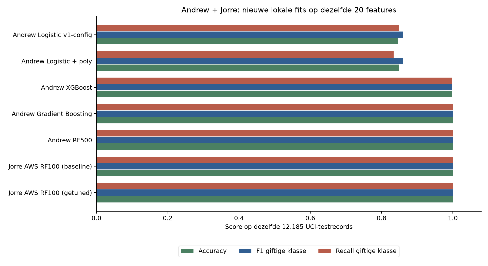
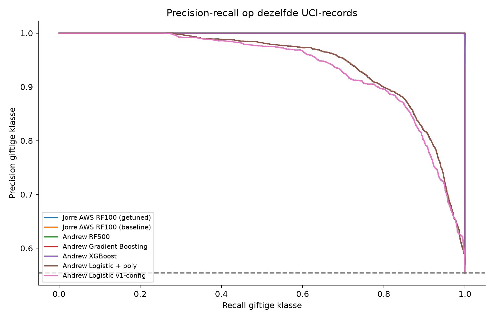
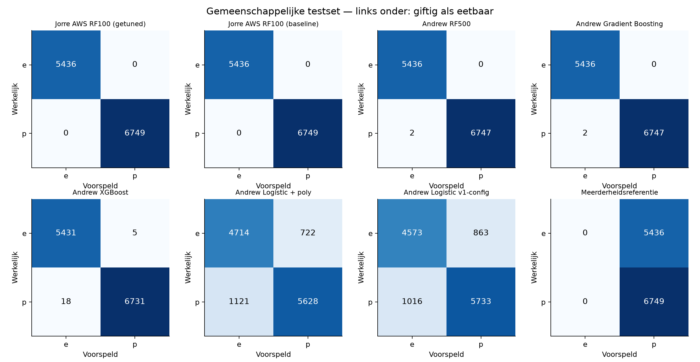

# Vergelijkingsrapport: Andrew + Jorre/AWS — Mushroom

**DeepLearningTeam10 — 9 oktober 2026.** Uitbreiding van de eerdere Andrew-vergelijking.
Hoofdnotebook: [09_compare_models.ipynb](09_compare_models.ipynb).
Bronmodeldefinities en exports: commit [`7fc26c2`](https://github.com/JorreVanDyck10/DeepLearningTeam10/commit/7fc26c2).

## Besluit

**Voorlopige keuze op de gedeelde UCI-data: Jorre AWS RF100 (getuned).**
De gemiddelde CV F1 p is **1.000000**. Op dezelfde 12.185 testrecords
haalt de nieuwe lokale fit **100.0000% accuracy**, met **0
giftige records als eetbaar** en **0 eetbare records als giftig**.
Er zijn exact gelijke beste CV F1- en recall-scores voor: **Jorre AWS RF100 (getuned), Jorre AWS RF100 (baseline)**. De vooraf vastgelegde voorkeur kiest bij zulke gelijke scores het reeds beschikbare, geregulariseerde AWS RF100 als die configuratie ertussen staat.

Het **ongewijzigde opgeslagen AWS-model** is daarnaast apart gecontroleerd in scikit-learn
1.7.2: de oorspronkelijke 100%-scores en confusion matrix worden gereproduceerd, met
0 FN en 0 FP. De nieuwe gezamenlijke vergelijking bestaat uit **lokale hertrainingen van
modelconfiguraties**. Andrew's oorspronkelijke 5.000-rijenmodellen krijgen daarmee geen
nieuwe scores toegeschreven: hun input is voor dit experiment aangepast naar dezelfde
twintig oorspronkelijke UCI-features. De historisch gemelde 81% en AWS 100% worden dus
niet rechtstreeks als gelijke experimenten gerangschikt.

De gedeelde testset was eerder in het AWS-notebook bekeken. Deze conclusie is een
ontwikkelbesluit, geen bewijs van perfecte generalisatie naar nieuwe soorten of echte
paddenstoelen. De API wordt door dit rapport niet naar een ander model omgeschakeld.

## 1. Opdracht, scope en bijdragen

De opdracht vraagt één vergelijkingsnotebook per dataset met verzamelde modelmetrics,
grondige vergelijking, foutanalyse en conclusies. Dit hoofdnotebook bevat nu zowel Andrew's
configuraties als Jorre's AWS-baseline en getunede configuratie, op één dataversie en split.
De [historische Andrew-deelvergelijking](09_andrew_vergelijkingsrapport.md) blijft beschikbaar
voor de reproductie van zijn originele notebookoutputs.

| Onderdeel | Bijdrage |
| --- | --- |
| Oorspronkelijke Andrew-modeldefinities, notebook en opgeslagen pipelines | Andrew Noeyens |
| Oorspronkelijke AWS-training, tuning en gedownloade exports | Jorre Van Dyck |
| Controle van het AWS-artifact, gezamenlijke lokale hertraining, vergelijking en rapportage | Codex op verzoek van Jorre |
| Review en eigen mondelinge verdediging | Nog door het team uit te voeren |

AI-gebruik is hiermee vermeld. Nieuwe lokale trainingsruns zijn niet uitgevoerd op AWS.
De oorspronkelijke AWS-export wordt behouden. AutoML, verdere tuning en Citi Bike zijn
geen nieuwe experimenten in deze uitbreiding; hun ontbrekende bewijs is hiermee niet aangevuld.

## 2. Oorspronkelijke resultaten en data-identiteit

| Oorspronkelijk experiment | Data / features | Testset | Gemelde testaccuracy | Status |
| --- | --- | --- | --- | --- |
| Andrew RF500 | Eigen CSV: 5.000 rijen, 12 features inclusief twee noise-velden | 900, gestratificeerd 18%, seed 42 | 81,00% | Eerder exact op bronprecisie gereproduceerd |
| Andrew Gradient Boosting | Dezelfde Andrew-data | Dezelfde 900 | 80,89% | Eerder gereproduceerd en opgeslagen pipeline gecontroleerd |
| Andrew XGBoost | Dezelfde Andrew-data | Dezelfde 900 | 78,67% | Eerder gereproduceerd met oorspronkelijke `n_jobs=-1` |
| Andrew Logistic + poly | Dezelfde Andrew-data | Dezelfde 900 | 67,11% | Eerder gereproduceerd |
| Andrew Logistic v1-config | Andere opgeslagen LR-configuratie, zelfde Andrew-data | Dezelfde 900 in gecontroleerde hertraining | 70,89% | Apart gehouden van notebook-LR |
| Jorre AWS RF100 getuned | UCI: 60.923 unieke rijen, 20 features | 12.185, gestratificeerd 20%, seed 42 | 100,00% | Opgeslagen model nu opnieuw op deze records gecontroleerd |

De eerdere Andrew RF200 in de API hoort bij een andere 80/20-split met 1.000 testrecords.
Zijn 78,2% is een historisch deploymentresultaat, geen score voor de nieuwe RF500-configuratie.

Voor de gezamenlijke vergelijking downloaden we met code het oorspronkelijke
[UCI-archief](https://archive.ics.uci.edu/dataset/848/secondary+mushroom+dataset).
Er zijn 61.069 oorspronkelijke rijen en twintig kenmerken. Na het verwijderen van
146 exacte duplicaten blijven 60.923 rijen over. `p` bevat giftige én niet aanbevolen
paddenstoelen met onbekende eetbaarheid; de gegevens zijn gesimuleerd vanuit 173 soorten.

Alle kandidaten krijgen de **zelfde 48.738 trainingsrecords en 12.185 testrecords**.
De testset heeft 5.436 `e` en 6.749 `p`. De invoer bevat de twintig bronfeatures, geen doelkolom
en geen Andrew-noisevelden. De raw-CSV heeft LF-genormaliseerde SHA-256
`a0d68cfc46c6900d67d30a49c6e1c3b8c37042dbd6e62ce38a9cf84a40c022e0`. De herkomst- en splitbestanden maken de rij-identiteit controleerbaar.

Er is **0 exacte feature-overlap** tussen
train en test. Deze check sluit afhankelijkheden binnen de simulatie of nabijgelegen
records niet uit. Er is geen betrouwbare soort-ID voor een soortgebonden eindtest in deze
vergelijking gebruikt. Een random split meet hier prestaties op deze simulatieverdeling.

## 3. Gecontroleerd opgeslagen AWS-model en tuning

Het artifact in [SolutionJorre/MushroomDataset](../SolutionJorre/MushroomDataset/) bevat
preprocessing én een Random Forest: 100 bomen, maximale diepte 24, minimaal twee records
per leaf, seed 42 en twee threads. Numerieke waarden krijgen de trainingsmediaan;
categorische ontbrekende waarden worden `missing`, gevolgd door one-hot encoding.
AWS is hier de trainingsomgeving; het modelalgoritme is scikit-learn Random Forest.

De controle reconstrueert de exacte AWS-split vanaf de brondata. De opgeslagen pipeline
verwacht twintig features en maakt 128 encoded features; `class` is uitgesloten.
Er waren geen versie- of inferentiewaarschuwingen. De opnieuw berekende confusion matrix is:

```text
              voorspeld e    voorspeld p
werkelijk e          5436              0
werkelijk p             0           6749
```

Accuracy, precision p, recall p, F1 p, ROC-AUC en AP zijn opnieuw 1,0. De modelhash is
`6f2e527adf52ad598b49925690009fa4ee2fc97bda19dfb2d07a802664aa1b53`. Het artifact is niet gewijzigd of opnieuw getraind.
Een afzonderlijk bewaard trainingsmanifest van de oorspronkelijke AWS-run ontbreekt;
trainingslidmaatschap van dat artifact is dus niet onafhankelijk bewezen. De gecontroleerde
nieuwe fit heeft wel een vastgelegd train/test-manifest zonder train-testoverlap.

Het AWS-notebook testte vier RandomizedSearchCV-kandidaten met drie trainingsfolds:

| Bomen | Max depth | Min leaf | CV F1 | SD | Rank |
| --- | --- | --- | --- | --- | --- |
| 100 | 24 | 2 | 1.000000 | 0.000000 | 1 |
| 200 | 24 | 1 | 1.000000 | 0.000000 | 1 |
| 100 | Geen limiet | 1 | 1.000000 | 0.000000 | 1 |
| 100 | 24 | 1 | 1.000000 | 0.000000 | 1 |

Alle kandidaten én de AWS-baseline hadden CV F1=1,0. De tuning levert hier dus **geen
gemeten verbetering**. De bronsearch kiest de eerste kandidaat uit de gedeelde beste
rank; uit deze tabel volgt niet dat depth 24/leaf 2 uniek optimaal is.

De auditomgeving gebruikt dezelfde scikit-learn 1.7.2 en pandas 2.3.3 als de export.
Python/NumPy verschillen van de SageMaker-omgeving (hier 3.13.7/2.2.6, oorspronkelijk
3.10.20/1.26.4); de vastgelegde inferentie-uitkomsten komen overeen. Voor de gezamenlijke
nieuwe fits gebruiken alle modellen dezelfde scikit-learn 1.9.1-omgeving.

## 4. Eerlijke gezamenlijke vergelijking

De featurekolommen van Andrew's configuraties worden uitgebreid naar de twintig UCI-features;
de oorspronkelijke noise-kolommen worden niet verzonnen of ingevuld. Zijn hyperparameters
blijven gelijk. De LR-v1 wordt gekloond zodat opgeslagen aangeleerde toestand verdwijnt,
met behoud van missing indicators, scaling en classifierinstellingen; de kolomselectie
wordt aangepast. Het getrainde v1-artifact zelf wordt niet voor deze UCI-scores gebruikt.

| Configuratie | Preprocessing en belangrijkste instellingen |
| --- | --- |
| AWS RF100 getuned | Numerieke mediaan; categorisch `missing` + OHE; 100 bomen, depth 24, leaf 2 |
| AWS RF100 baseline | Dezelfde AWS-preprocessing; 100 bomen, geen depth-limiet, leaf 1 |
| Andrew RF500 | Nullen in stemmetingen → ontbrekend; numerieke mediaan; categorische modus + OHE; 500 bomen, depth 20, split 3, leaf 1, balanced |
| Andrew Gradient Boosting | Dezelfde Andrew-preprocessing; 350 bomen, learning rate 0,08, depth 8, split 4, leaf 2 |
| Andrew XGBoost | Dezelfde Andrew-preprocessing; 500 bomen, learning rate 0,05, depth 5, min child weight 2, subsample/colsample 0,8 |
| Andrew Logistic + poly | Andrew-schoonmaak; mediaan + numerieke polynomial features graad 2 + scaling; C=1, balanced, max iter 3.000 |
| Andrew Logistic v1-config | Andrew-schoonmaak; mediaan + missing indicators + scaling; categorische modus + OHE; C=1, geen class weights, max iter 2.000 |
| Meerderheidsreferentie | Voorspelt steeds de meerderheidsklasse `p` in deze UCI-versie |

We vergelijken **volledige pipelineconfiguraties**, dus verschillen kunnen uit preprocessing
én classifierinstellingen komen. Dit is geen geïsoleerde causaliteitsproef van één algoritme.
Andrew's nulmetingen-schoonmaak is overgenomen voor reproductie; haar inhoudelijke noodzaak
op de volledige UCI-data is hiermee niet bewezen en vraagt nog een afzonderlijke EDA/ablation.

Op de gedeelde trainingsset gebruiken we drie identieke gestratificeerde folds met shuffle
en seed 42, zoals in de AWS-opzet. Imputatie, encoding, scaling en modeltraining worden
uitsluitend op de trainingsrecords van elke fold gefit. Er is geen nieuwe hyperparametersearch.
De selectie gebruikt gemiddelde CV F1 p, daarna CV recall p. Bij exacte gelijke beste scores
staat de beschikbare, geregulariseerde AWS RF100 vooraf eerst in de voorkeurvolgorde.
De keuze wordt vastgelegd **vóór** het berekenen van de gemeenschappelijke testmetrics.

F1 balanceert precision en recall; FN en recall p blijven afzonderlijk zichtbaar omdat
giftig als eetbaar een ander fouttype is dan eetbaar als giftig. F1 is geen veiligheidsnorm.
De standaard `predict`-drempel rond 0,5 blijft behouden. Er is geen tuning of drempelkeuze
op test gedaan. Zie het [validatieprotocol](https://scikit-learn.org/stable/modules/cross_validation.html).

## 5. Gezamenlijke resultaten

### Kruisvalidatie: basis voor de modelkeuze

| Configuratie | CV F1 p ± SD | CV recall p | CV accuracy |
| --- | --- | --- | --- |
| Jorre AWS RF100 (getuned) | 1.000000 ± 0.000000 | 1.000000 | 1.000000 |
| Jorre AWS RF100 (baseline) | 1.000000 ± 0.000000 | 1.000000 | 1.000000 |
| Andrew Gradient Boosting | 0.999926 ± 0.000032 | 0.999889 | 0.999918 |
| Andrew RF500 | 0.999666 ± 0.000255 | 0.999370 | 0.999631 |
| Andrew XGBoost | 0.998424 ± 0.000569 | 0.997740 | 0.998256 |
| Andrew Logistic + poly | 0.854479 ± 0.003246 | 0.823621 | 0.844639 |
| Andrew Logistic v1-config | 0.854227 ± 0.002338 | 0.840922 | 0.841048 |
| Meerderheidsreferentie | 0.712865 ± 0.000029 | 1.000000 | 0.553839 |

SD is de spreiding over drie folds, geen betrouwbaarheidsinterval voor de rangschikking.
Afgeronde 100%-scores kunnen kleine verschillen verbergen; daarom tonen we zes decimalen
en ook de absolute foutaantallen. De nieuwe CV-scores horen bij deze volledige UCI-versie,
niet bij Andrew's eerdere vijf folds op 4.100 records.

### Test-audit op dezelfde 12.185 records

| Configuratie | Accuracy | Precision p | Recall p | F1 p | ROC-AUC | AP | FN | FP |
| --- | --- | --- | --- | --- | --- | --- | --- | --- |
| Jorre AWS RF100 (getuned) | 1.000000 | 1.000000 | 1.000000 | 1.000000 | 1.000000 | 1.000000 | 0 | 0 |
| Jorre AWS RF100 (baseline) | 1.000000 | 1.000000 | 1.000000 | 1.000000 | 1.000000 | 1.000000 | 0 | 0 |
| Andrew RF500 | 0.999836 | 1.000000 | 0.999704 | 0.999852 | 1.000000 | 1.000000 | 2 | 0 |
| Andrew Gradient Boosting | 0.999836 | 1.000000 | 0.999704 | 0.999852 | 1.000000 | 1.000000 | 2 | 0 |
| Andrew XGBoost | 0.998112 | 0.999258 | 0.997333 | 0.998294 | 0.999958 | 0.999967 | 18 | 5 |
| Andrew Logistic + poly | 0.848748 | 0.886299 | 0.833901 | 0.859302 | 0.922041 | 0.943266 | 1121 | 722 |
| Andrew Logistic v1-config | 0.845794 | 0.869163 | 0.849459 | 0.859198 | 0.913594 | 0.936073 | 1016 | 863 |
| Meerderheidsreferentie | 0.553878 | 0.553878 | 1.000000 | 0.712897 | 0.500000 | 0.553878 | 0 | 5436 |



ROC-AUC en average precision beoordelen de rangschikking van p-scores over drempels.
Ze tonen niet of deze scores gekalibreerde kansen zijn. Er is geen kalibratieonderzoek gedaan.
De referentie voorspelt altijd `p`: hierdoor kan recall 1,0 zijn terwijl specificity 0 is.
Een hoge recall of accuracy op zichzelf is dus onvoldoende.



De nieuwe AWS-fit en het opgeslagen AWS-artifact verschillen in
**0 testlabels**.
Het maximale verschil in p-score is
**2.220446e-16**.
Dit controleert consistentie op deze records, niet prestaties op nieuwe data.

## 6. Foutanalyse en onzekerheid

| Configuratie | TN e→e | FP e→p | FN p→e | TP p→p |
| --- | --- | --- | --- | --- |
| Jorre AWS RF100 (getuned) | 5436 | 0 | 0 | 6749 |
| Jorre AWS RF100 (baseline) | 5436 | 0 | 0 | 6749 |
| Andrew RF500 | 5436 | 0 | 2 | 6747 |
| Andrew Gradient Boosting | 5436 | 0 | 2 | 6747 |
| Andrew XGBoost | 5431 | 5 | 18 | 6731 |
| Andrew Logistic + poly | 4714 | 722 | 1121 | 5628 |
| Andrew Logistic v1-config | 4573 | 863 | 1016 | 5733 |
| Meerderheidsreferentie | 0 | 5436 | 0 | 6749 |



De gekozen configuratie maakt 0 testfouten. Het beschrijvende
Wilson-interval van 95% voor accuracy is **99.9685–100.0000%**;
voor recall p **99.9431–100.0000%**. Ook nul geobserveerde fouten
bewijst geen nul foutkans in de populatie. De intervallen veronderstellen onafhankelijke
records en corrigeren niet voor eerdere experimenten, modelselectie of simulatiestructuur.

Voor concrete fouten bekijken we de zwakste getrainde kandidaat op test-F1:
**Andrew Logistic v1-config**. Dit is een achteraf gekozen foutanalyse, geen selectie- of tuningcriterium.
Onder de onterecht eetbaar gelabelde giftige records staan de drie laagste p-scores:

| Model | Unieke rij / bronrij (0-based) | Werkelijk → voorspeld | Score p | Ontbrekende features |
| --- | --- | --- | --- | --- |
| Andrew Logistic v1-config | 58573 / 58719 | p → e | 0.005188 | 6 |
| Andrew Logistic v1-config | 58756 / 58902 | p → e | 0.008153 | 6 |
| Andrew Logistic v1-config | 58488 / 58634 | p → e | 0.011454 | 6 |

Alle foutrecords met bronfeatures zijn bewaard in
[shared_error_records.csv](comparison_team/shared_error_records.csv).
Eén tabelrij kan per foutmakend model terugkomen. Gemiddelde scores vertellen niet welke
combinaties problematisch zijn; daarom behoudt het notebook deze voorbeelden en het aantal
ontbrekende kenmerken. De voorbeelden alleen bewijzen geen oorzakelijk effect van imputatie.

Het accuracyverschil tussen AWS100 en Andrew RF500/Gradient Boosting is slechts **twee
records op 12.185**, ongeveer **0,0164 procentpunt**. Een exacte gepaarde McNemar-toets
geeft in beide vergelijkingen p=0,5: dit kleine testverschil bewijst niet dat AWS100
statistisch beter presteert. Het bewijst ook geen equivalentie.
De paarvergelijkingen in het JSON-bestand zijn exploratief, zonder meervoudige-toetscorrectie;
de CV-regel en praktische tie-breaker blijven het selectiecriterium.

We schrijven de betere uitkomsten op UCI niet toe aan alleen "meer training" of "AWS".
Andrew's oorspronkelijke input had minder kenmerken, twee noisevelden en een andere
klasseverdeling/ontbrekendheid. De nieuwe vergelijking houdt de rijen en bronfeatures gelijk;
een specifiek effect van datavolume, featurekeuze of noise vraagt afzonderlijke ablation.

## 7. Training, complexiteit en praktische keuze

| Configuratie | Train F1 p | Test F1 p | Fit (s) | Proba 12.185 records (ms) | Pipeline (MiB) |
| --- | --- | --- | --- | --- | --- |
| Jorre AWS RF100 (getuned) | 1.000000 | 1.000000 | 7.11 | 163.20 | 1.765 |
| Jorre AWS RF100 (baseline) | 1.000000 | 1.000000 | 7.55 | 136.15 | 1.971 |
| Andrew RF500 | 0.999907 | 0.999852 | 10.13 | 289.26 | 8.820 |
| Andrew Gradient Boosting | 1.000000 | 0.999852 | 121.94 | 616.25 | 3.296 |
| Andrew XGBoost | 0.998573 | 0.998294 | 2.62 | 123.33 | 0.242 |
| Andrew Logistic + poly | 0.858052 | 0.859302 | 1.07 | 63.83 | 0.004 |
| Andrew Logistic v1-config | 0.855929 | 0.859198 | 0.75 | 58.52 | 0.004 |

Train-testverschillen kunnen op overfitting wijzen, maar zijn geen bewijs van één oorzaak.
Een zwakkere LR-score op train én test wijst op beperkingen van deze representatie of
instellingen; het bewijst niet dat alle lineaire modellen slecht zijn.

Tijden zijn lokale metingen op Windows 11 met twintig logische CPU's. Fit is één training
op 48.738 records; proba-tijd is de mediaan van vijf batches van 12.185 records; pipelinegrootte
is joblib-compressie 3 inclusief preprocessing. AWS-configuraties gebruiken twee threads,
Andrew RF/XGBoost `n_jobs=-1`. Dit is geen gecontroleerde vergelijking van algoritmische
rekenefficiëntie en geen Render-latencybenchmark. Modelgrootte en beschikbaarheid zijn wel
praktische afwegingen wanneer validatiescores gelijk zijn.

Er zijn exact gelijke beste CV F1- en recall-scores voor: **Jorre AWS RF100 (getuned), Jorre AWS RF100 (baseline)**. De vooraf vastgelegde voorkeur kiest bij zulke gelijke scores het reeds beschikbare, geregulariseerde AWS RF100 als die configuratie ertussen staat. De keuze is daarmee praktisch onderbouwd en wordt niet voorgesteld als
een statistisch bewezen uniek beste model. Het AWS-notebookmodel is beschikbaar als complete
pipeline; een gedeelde prestatie zou op zichzelf geen reden zijn om een veel groter model
naar de backend te verhuizen.

## 8. Beperkingen en acties voor de eindinlevering

De opdracht vraagt ook AutoML, systematische tuning, uitleg per model, EDA en een werkende
deploymentpipeline. De gezamenlijke vergelijking vult alleen het modelvergelijkingsdeel aan.
Voor de definitieve inlevering zijn onder meer nog nodig:

1. Leg het uiteindelijke probleem en generalisatiedoel vast. Een random split binnen
   gesimuleerde soorten is geen test op nieuwe soorten of echte paddenstoelen.
2. Voeg ontbrekende AutoML/team-experimenten toe aan hetzelfde datacontract en protocol.
   Behoud tuninglogs; rapporteer ook experimenten zonder verbetering.
3. Gebruik een eindtest die niet al voor ontwikkeling is bekeken, of motiveer een passend
   alternatief. Het huidige AWS-testresultaat is eerder bekend geweest.
4. Laat het team de preprocessing, metrickeuze, tie-breaker en concrete fouten reviewen
   en zelf kunnen uitleggen. Gebruik modelbestanden met de passende versies.
5. Als het team voor het AWS-model kiest: pas API en frontend bewust van Andrew's twaalf
   velden naar de twintig AWS-features aan, en valideer voorspellingen tegen het notebook.
   Het gepubliceerde model is op dit moment nog de oudere RF200.

Het laden van een scikit-learn-pipeline uit een andere versie is geen betrouwbare migratie;
zie [model persistence](https://scikit-learn.org/stable/model_persistence.html).
Deze uitbreiding heeft de originele bronnotebooks en modelbestanden niet aangepast.

## 9. Reproduceren en bewijs

Voer vanuit de repositoryroot twee afzonderlijke omgevingen uit:

```powershell
py -3.13 -m venv .venv-aws-audit
.\.venv-aws-audit\Scripts\python.exe -m pip install -r secondary_mushroom/requirements-aws-audit.txt
.\.venv-aws-audit\Scripts\python.exe secondary_mushroom/audit_aws_model.py

py -3.13 -m venv .venv-analysis
.\.venv-analysis\Scripts\python.exe -m pip install -r secondary_mushroom/comparison-requirements.txt
.\.venv-analysis\Scripts\python.exe secondary_mushroom/compare_team_models.py
.\.venv-analysis\Scripts\python.exe secondary_mushroom/build_team_comparison_report.py --execute
```

De twee omgevingen scheiden het laden van het originele artifact (1.7.2) van nieuwe fits
(1.9.1). De notebooks laden standaard de bewaarde resultaten; een volledige hertraining
gebeurt met het script of `RUN_TRAINING=True`. Op andere hardware kunnen timing en sommige
numerieke uitkomsten veranderen. Bewaar bij nieuwe runs de hashes, parameters en versies.

| Bestand | Inhoud |
| --- | --- |
| [09_compare_models.ipynb](09_compare_models.ipynb) | Uitgevoerd hoofdnotebook: Andrew + Jorre/AWS |
| [09_compare_andrew_models.ipynb](09_compare_andrew_models.ipynb) | Historische reproductie van Andrew's eigen 5.000-rijenexperiment |
| [audit_aws_model.py](audit_aws_model.py) | Controle van het ongewijzigde opgeslagen AWS-model |
| [compare_team_models.py](compare_team_models.py) | Gezamenlijke lokale training en CV-selectie |
| [comparison_data.py](comparison_data.py) | Gecodeerde UCI-download, deduplicatie en gedeelde split |
| [build_team_comparison_report.py](build_team_comparison_report.py) | Rapport en uitgevoerd notebook opbouwen |
| [aws_artifact_audit.json](comparison_team/aws_artifact_audit.json) | Modelhash, schema, omgeving en opnieuw berekende AWS-scores |
| [aws_artifact_predictions.csv](comparison_team/aws_artifact_predictions.csv) | Alle voorspellingen van het oorspronkelijke AWS-artifact |
| [shared_comparison_summary.json](comparison_team/shared_comparison_summary.json) | Gedeelde parameters, versies, scores en keuze |
| [shared_cv_folds.csv](comparison_team/shared_cv_folds.csv) | Alle 24 model/fold-evaluaties |
| [shared_split_manifest.csv](comparison_team/shared_split_manifest.csv) | Unieke rij-index, originele bronrij, train/test en fold |
| [shared_model_comparison.csv](comparison_team/shared_model_comparison.csv) | Exacte vergelijkingstabel |
| [shared_test_predictions.csv](comparison_team/shared_test_predictions.csv) | Labels en p-scores per model op dezelfde testrecords |
| [shared_error_records.csv](comparison_team/shared_error_records.csv) | Concrete foutrecords per model |
